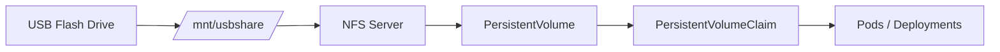
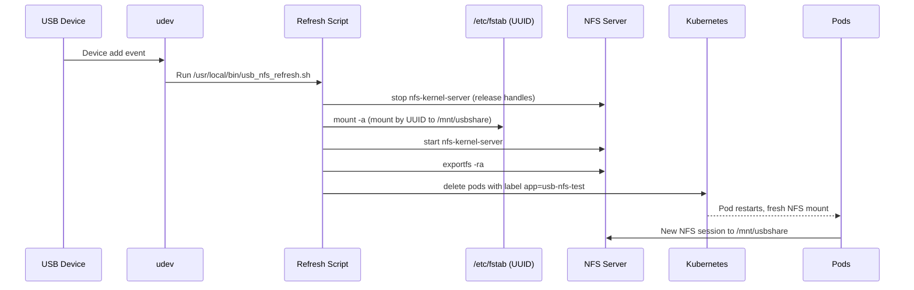

# USB‑backed NFS for Kubernetes (Ubuntu) — Step‑by‑Step

This guide turns a hot‑pluggable USB flash drive into a network share via **NFS**, then mounts it in **Kubernetes** using **PV/PVC**. It also includes automation so that unplug/replug events remount the USB, refresh NFS, and restart affected pods.

> Target host OS: Ubuntu (acts as NFS server).  
> Kubernetes: any distro, as long as nodes can reach the NFS server over the LAN.  
> Example device: SanDisk Cruzer Blade with `UUID=2964-1824` and label `FAPS`.

---

## Architecture


---

## ✅ Outcome
- `USB → /mnt/usbshare → NFS → PV → PVC → /data in pods`
- Safe across unplug/replug using UUID + udev automation.

---

## 0) Prerequisites
- Ubuntu host with sudo access (the NFS server).  
- USB drive, any filesystem (here: `vfat`).  
- Kubernetes cluster nodes can reach the Ubuntu host’s IP (e.g., `192.168.209.203`).

---

## 1) Identify the USB & its UUID
```bash
lsusb
lsblk
sudo fdisk -l /dev/sdX
sudo blkid /dev/sdX2   # Find UUID and TYPE
```
Record the **UUID** (example: `2964-1824`) and the **data partition** (example: `/dev/sdb2`).

---

## 2) Create a stable mount point and mount by UUID
Create the mount point and add an `/etc/fstab` entry using **UUID** (never `/dev/sdX`).

```bash
sudo mkdir -p /mnt/usbshare
sudo nano /etc/fstab
```
Add exactly this line (adjust TYPE if not vfat):
```fstab
UUID=2964-1824  /mnt/usbshare  vfat  defaults,noatime,nofail  0  0
```
Apply it:
```bash
sudo systemctl daemon-reload
sudo mount -a
# verify
df -h | grep usbshare
ls /mnt/usbshare
```

> **Tip:** `nofail` lets the system boot even if the USB isn’t inserted.

---

## 3) Install and configure NFS server
```bash
sudo apt update
sudo apt install -y nfs-kernel-server
```
Export the mounted directory to your LAN (edit your subnet as needed):
```bash
sudo nano /etc/exports
```
Add:
```exports
/mnt/usbshare 192.168.209.0/24(rw,sync,no_subtree_check,no_root_squash)
```
Reload exports:
```bash
sudo exportfs -ra
sudo systemctl restart nfs-kernel-server
showmount -e localhost
```
Test from another Linux host:
```bash
sudo apt install -y nfs-common
sudo mkdir -p /mnt/testusb
sudo mount -t nfs 192.168.209.203:/mnt/usbshare /mnt/testusb
ls /mnt/testusb
```

---

## 4) Kubernetes manifests (PV, PVC, Pod)
Create one file (e.g., `usb-nfs.yaml`):
```yaml
apiVersion: v1
kind: PersistentVolume
metadata:
  name: usb-nfs-pv
spec:
  capacity:
    storage: 28Gi
  accessModes:
    - ReadWriteMany
  persistentVolumeReclaimPolicy: Retain
  nfs:
    server: 192.168.209.203      # NFS server (Ubuntu host)
    path: /mnt/usbshare
---
apiVersion: v1
kind: PersistentVolumeClaim
metadata:
  name: usb-nfs-pvc
spec:
  accessModes:
    - ReadWriteMany
  resources:
    requests:
      storage: 1Gi
---
apiVersion: v1
kind: Pod
metadata:
  name: usb-nfs-pod
  labels:
    app: usb-nfs-test
spec:
  containers:
  - name: usb-nfs-container
    image: alpine:latest
    command: ["sleep", "3600"]
    volumeMounts:
    - name: usb-nfs-volume
      mountPath: /data
  volumes:
  - name: usb-nfs-volume
    persistentVolumeClaim:
      claimName: usb-nfs-pvc
  restartPolicy: Always
```
Apply and verify:
```bash
kubectl apply -f usb-nfs.yaml
kubectl get pv,pvc,pods
kubectl exec -it usb-nfs-pod -- sh -c 'ls -l /data'
```

---

## 5) Automate hot‑plug recovery (udev + script)
When you unplug/replug, the kernel renumbers the device (e.g., `/dev/sdb` → `/dev/sdc`).  
Because we mount by **UUID**, we can auto‑remount and refresh NFS and pods.

### 5.1 Create the refresh script
```bash
sudo nano /usr/local/bin/usb_nfs_refresh.sh
```
Paste:
```bash
#!/bin/bash
logger "USB device detected – remounting and refreshing NFS + pods"
# Let kernel settle
sleep 3
MNT="/mnt/usbshare"
# Stop NFS to release open handles
systemctl stop nfs-kernel-server 2>/dev/null
# Unmount even if busy/stale
if mountpoint -q "$MNT"; then
  fuser -km "$MNT" 2>/dev/null || true
  umount -lf "$MNT" 2>/dev/null || true
fi
# Remount by UUID via fstab
systemctl daemon-reload
mount -a
# Restart NFS and refresh exports
systemctl start nfs-kernel-server
exportfs -ra
# Bounce any pods using this volume (label selector)
if command -v kubectl &> /dev/null; then
  /usr/bin/kubectl delete pod -l app=usb-nfs-test --ignore-not-found
fi
logger "USB NFS remount + pod refresh complete"
echo "$(date) - usb_nfs_refresh.sh triggered by udev" >> /var/log/usb-nfs.log
```
Make it executable:
```bash
sudo chmod +x /usr/local/bin/usb_nfs_refresh.sh
sudo chown root:root /usr/local/bin/usb_nfs_refresh.sh
```

### 5.2 Add a udev rule for your USB model
Get vendor/product IDs:
```bash
lsusb | grep -i sandisk
# Example: ID 0781:5567 SanDisk Corp. Cruzer Blade
```
Create the rule:
```bash
sudo nano /etc/udev/rules.d/99-usb-nfs.rules
```
Paste (adjust IDs if different):
```udev
ACTION=="add", SUBSYSTEM=="block", ENV{DEVTYPE}=="partition", ENV{ID_VENDOR}=="SanDisk", ENV{ID_MODEL}=="Cruzer_Blade", RUN+="/bin/systemd-run --no-block />
```
Reload:
```bash
sudo udevadm control --reload
sudo udevadm trigger
```

### 5.3 Test the full cycle
```bash
# Watch logs
sudo tail -n 5 /var/log/usb-nfs.log
OR
sudo journalctl -f | grep -i usb
# Unplug → replug the USB
# Within a few seconds you should see the script logs

df -h | grep usbshare
kubectl get pods | grep usb-nfs-pod
kubectl exec -it usb-nfs-pod -- sh -c 'ls -l /data'
```

---

## 🔄 Event flow (on plug‑in)


---

## 🧪 Troubleshooting
**Mount says “target is busy”**  
Kill holders and lazy‑unmount, then remount:
```bash
sudo systemctl stop nfs-kernel-server
sudo fuser -km /mnt/usbshare || true
sudo umount -lf /mnt/usbshare || true
sudo systemctl daemon-reload
sudo mount -a
sudo systemctl start nfs-kernel-server
sudo exportfs -ra
```

**Pod shows phantom files (No such file or directory)**  
NFS client has a stale handle. Restart the pod (or let the script do it):
```bash
kubectl delete pod -l app=usb-nfs-test --ignore-not-found
```

**USB enumerates as a new /dev/sdX**  
This is normal. Using UUID in `/etc/fstab` makes it irrelevant.

**Permission issues inside pods**  
For testing, relax permissions on the mount:
```bash
sudo chmod 777 /mnt/usbshare
```
Then tighten later using proper UID/GID mapping or export options.

**Firewall**  
Ensure NFS ports are allowed on the server (or disable UFW for a quick test):
```bash
sudo ufw allow from 192.168.209.0/24 to any port nfs
```

---

## 🔐 Security notes
- `no_root_squash` is convenient but reduces isolation; prefer user‑mapped writes in production.  
- NFS has weak auth; consider using a trusted LAN/VPN.  
- USB flash has limited write endurance; avoid heavy write workloads.

---

## 🚀 Performance tips
- Use `noatime` in fstab to reduce writes.  
- Prefer larger, sequential writes; avoid tiny sync writes over NFS.  
- For heavier needs, consider a small NAS or SSD over USB3.

---

## ✅ You now have
- A hot‑pluggable USB drive mounted by **UUID** → exported via **NFS** → consumed by **K8s PVC**.  
- Automation that self‑heals after unplug/replug.

